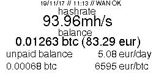

# coin-ticker
https://desaille.fr/raspberry-pi-bitcoin-ticker/

## Screenshots
### TickerDisplay_Miner.py

## Installation
### Sur raspbian
Installer les dépendances python (Pillow, Requests, Json, Time)
> sudo apt install python-requests
> sudo apt install python-pil
> sudo apt install fonts-freefont-ttf

Cloner le repository
> cd /opt
> git clone https://github.com/bashou/coin-ticker

## Démarrage automatique
### Supervisor
Je prefère cette solution car il m'est arrivé que le service tombe et evidement il ne repart pas tout seul.

Installer supervisor (si vous ne voulez pas utiliser sysv ou systemd)
> sudo apt install supervisor
* Copier le fichier /opt/coin-ticker/supervisor/conf.d/cointicker.conf dans /etc/supervisor/conf.d/
> sudo service supervisor restart

### Sysv-init / SystemD
* Copier le fichier /opt/coin-ticker/sysvinit/cointicker.sh dans /etc/init.d/
* Le rendre executable `chmod u+x /etc/init.d/cointicker.sh`
* l'ajouter au runlevel default : `update-rc.d cointicker.sh defaults`

Enjoy !

## Scripts annexes
### Pour les mineurs

Un script cointicker_miner.sh existe se basant sur TickerDisplay_Miner.py.
Il utilise Nicehash et EthOS en variables d'entrée que vous retrouverez dans le fichier TickerDisplay_Miner.py :
> NH_WALLET   = '<votre wallet nicehash>'
> NH_API_KEY  = '<une API key en RO suffit de votre compte nicehash>'
> NH_API_ID   = '<une API ID de votre compte nicehash>'
> ETHOS_ID    = '<l'ID de votre instance ethos (disponible via `helpme` sur ethos : XXXX.ethosdistro.com)'

Cela affiche le hashrate de vos rigs, le rendement sur nicehash, le court actuel du bitcoin, l'heure, la date et un test simple de votre connexion internet.